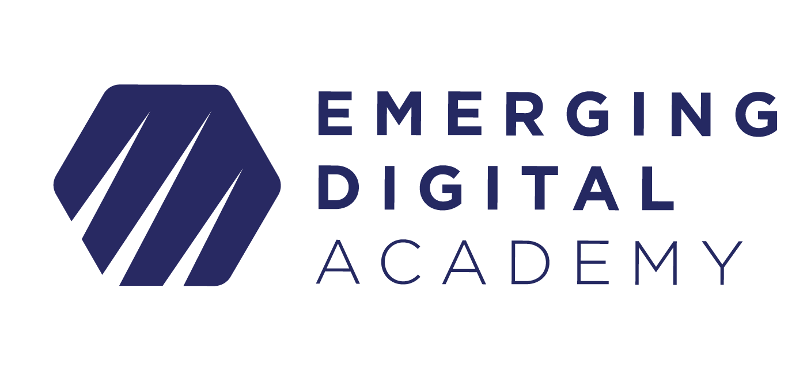

# Python and Flask Workshop

## [Workshop Video](https://vimeo.com/771394146/cc7597882b)

## Welcome!

Hello, and welcome to the Emerging Digital Academy: Python and Flask Workshop. Today we will be going over the basics of creating an MVT API with Python and Flask!

## Requirements

As this is an intro workshop, there are not many requirements except:

- A working installation of Python3 on your machine
  - [Python Download Link](https://www.python.org/downloads/)
- The VS Code text editor installed
  - [VSCode Download Link](https://code.visualstudio.com/download)
- An eagerness to learn

## Agenda

The content we will be going over will include:

- **Key Web Development terms**
  - HTTP
  - API
  - MVT (or MVC)
- **Flask**
  - What is it
  - Why do we use it
  - What tools come installed with flask
- **Time to build!**

## Resources

Different resources that will be helpful throughout the workshop:

- [W3 Schools](https://www.w3schools.com/python/default.asp)
- [Python3 Documentation](https://docs.python.org/3/)
- [Flask Documentation](https://flask.palletsprojects.com/en/2.2.x/)

## Application Preview

# py-flask-workshop
